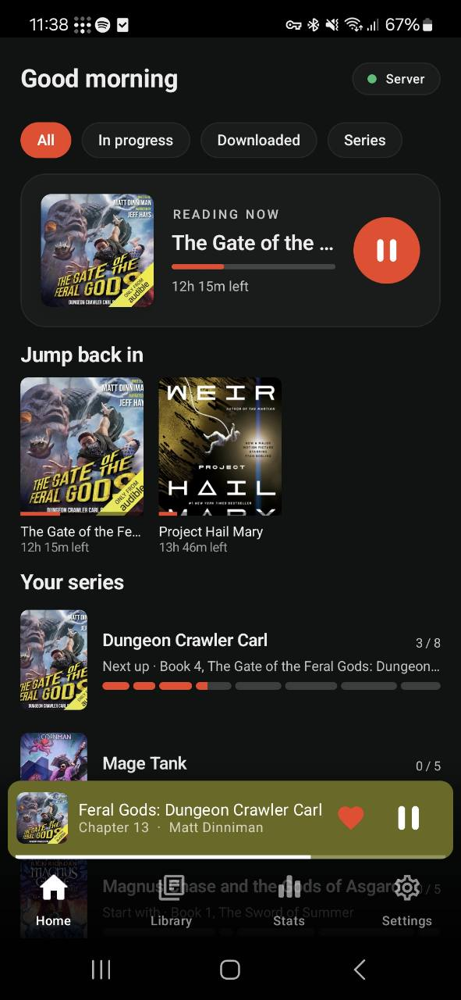
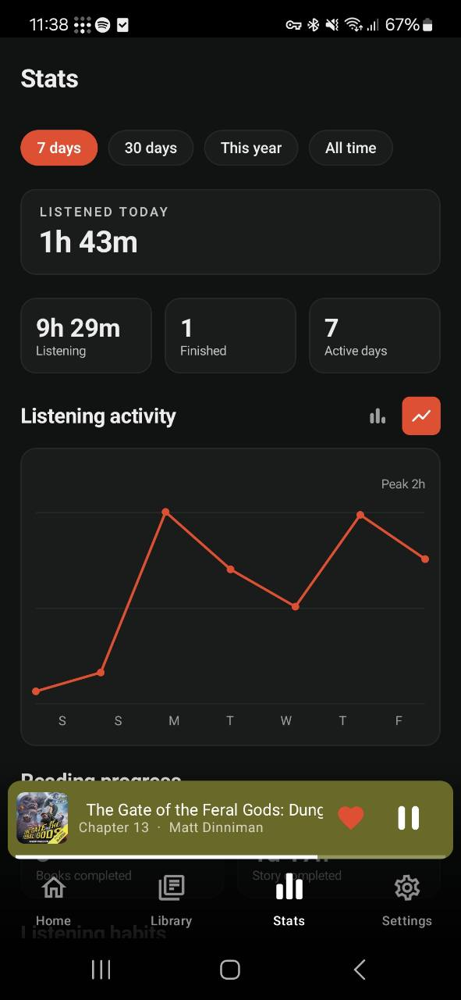
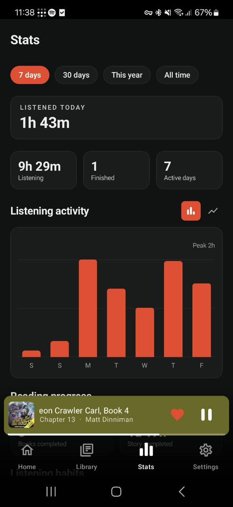

# Fukuro

Fukuro is a personal Android client for [Audiobookshelf](https://www.audiobookshelf.org/), built for sideloading and daily listening. It focuses on fast library browsing, reliable playback, offline access, Android Auto, and local-first listening state.

<p>
  
  
  
  
</p>

## What It Does

- Streams audiobooks from an Audiobookshelf server with Media3/ExoPlayer.
- Plays in the background with notification, lock-screen, headset, and Android Auto controls.
- Downloads books for offline listening, including offline Android Auto browsing.
- Saves playback position locally first, then syncs progress back to Audiobookshelf.
- Keeps listening stats available offline by caching server stats and merging them with local sessions.
- Supports series, authors, narrators, favorites, chapters, sleep timers, playback speed, uploads, and home-screen customization.

## Highlights

### Local-first playback

Playback position is written to the device during listening, whether the server is reachable or not. When the connection returns, Fukuro pushes local progress and listening sessions back to Audiobookshelf.

### Offline library access

Downloaded books stay playable without a server connection. Fukuro also exposes downloaded and continue-listening shelves to Android Auto, so offline listening still works from the car screen.

### Stats that survive outages

The Stats page combines Audiobookshelf listening history with local sessions recorded on the phone. Recent server stats are cached, so the page still has useful history while offline. Pull down on the Stats page to refresh server stats and library state.

### Designed for a personal server

Fukuro assumes a self-hosted Audiobookshelf setup and keeps LAN HTTP support enabled for home use. For remote access, put Audiobookshelf behind HTTPS or connect through a VPN.

## Feature Overview

| Area | Details |
| --- | --- |
| Playback | Streaming, background service, notification controls, lock-screen controls, headset support, chapter seeking |
| Sync | Progress sync every 15 seconds and on pause, local fallback while offline, local listening session upload |
| Offline | Downloaded books, on-device library support, offline playback, Android Auto access to downloaded items |
| Library | Home shelves, full library grid, series pages, author and narrator pages, cover caching |
| Organization | Favorites, custom home shelves, continue-listening hiding, sort and filter controls |
| Player | Chapter list, sleep timer, playback speed up to 10x, configurable chapter/book progress display |
| Stats | Period summaries, activity chart, streaks, recent sessions, completion highlights, year-in-review card |
| Server tools | Rename, mark finished, reset progress, upload books with an Audiobookshelf API key |
| Appearance | Light, dark, system theme, Material You, and fixed accent colors |

## Installation

Download the latest APK from [Releases](../../releases), copy it to your Android device, and open it to install.

If Android blocks the install, allow installs from the app you used to open the APK. For Android Auto with a sideloaded app, enable `Developer settings -> Unknown sources` in Android Auto.

## First Run

1. Enter your Audiobookshelf server URL, for example `http://192.168.x.x:13378`.
2. Log in with your Audiobookshelf username and password.
3. Optional: add an Audiobookshelf API key in Settings to enable uploads.
4. Optional: download books you want available away from the server.

## Building

Requirements:

- JDK 17
- Android SDK platform 35
- Android build tools 35

Build a debug APK:

```sh
./gradlew assembleDebug
```

The APK is written to:

```text
app/build/outputs/apk/debug/app-debug.apk
```

Debug builds use the `nl.codefin.fukuro.glassdev` application ID and the name `Fukuro Test`, so they can live next to the published sideload build.

## Project Layout

The Android code intentionally lives in one flat `fukuro` package.

```text
build.gradle.kts          Plugin versions
settings.gradle.kts       Repositories
app/build.gradle.kts      Android config and dependencies
app/src/main/
  AndroidManifest.xml
  res/                    Icon, colors, strings, Android Auto descriptor
  java/fukuro/
    ShelfApp.kt           App singleton
    Api.kt                Audiobookshelf REST client
    Models.kt             API data classes
    Store.kt              DataStore settings, local progress, cached stats
    Downloads.kt          Offline downloads
    PlayerService.kt      Media3 playback and Android Auto browse tree
    MainActivity.kt       Navigation, bottom bar, mini player
    ShelfViewModel.kt     UI state and sync coordination
    Screens.kt            Login, library, series, author, narrator, book sheets
    HomeScreen.kt         Home shelves
    PlayerScreen.kt       Full player
    StatsScreen.kt        Listening charts, habits, recent sessions
    SettingsScreen.kt     Settings and admin settings
    UploadScreen.kt       Upload a book
    Theme.kt              Color schemes and dark mode
    CoverImage.kt         Cover and author images
```

## Release Process

Pushing a version tag such as `v1.10.21` triggers the GitHub Actions release workflow. The workflow builds a signed release APK, creates the matching GitHub Release, and attaches the APK plus its SHA-256 checksum.

Before publishing releases, configure these repository Actions secrets:

- `ANDROID_KEYSTORE_BASE64`: release keystore encoded as Base64
- `ANDROID_KEYSTORE_PASSWORD`: keystore password
- `ANDROID_KEY_ALIAS`: signing key alias
- `ANDROID_KEY_PASSWORD`: signing key password

Keep the keystore and passwords backed up. Android requires future updates to be signed with the same key.

PowerShell keystore encoding helper:

```powershell
[Convert]::ToBase64String([IO.File]::ReadAllBytes("fukuro-release.jks")) |
    Set-Clipboard
```

## Notes

- Favorites are stored locally because Audiobookshelf does not provide a favorites concept.
- Cleartext HTTP is enabled for local network use.
- Release builds use the `nl.codefin.fukuro` application ID.
- Debug builds install separately as `Fukuro Test`.
